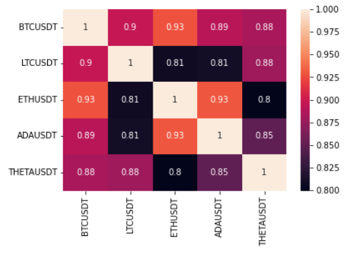
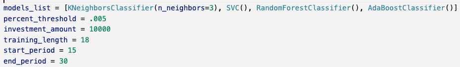

# Crypto Money Maker

This project was built to use machine learning in conjunction with technical indicators to identify buy signals for bitcoin using hourly price data over various time periods.  Ultimately, the project was not able to determine a combination of technical indicators, machine learning algorithms, and time periods that earned a positive return.  However, the notebook structure can continue to be used to investigate other models and time periods.  Another possibility moving forward is to change the underlying from bitcoin to a less volitile stock fund like the S&P Index or QQQ.  

---

## Technologies

This application opens in a Jupyter Notebook.  Also, a Google Colab instance can be found [here](https://colab.research.google.com/drive/16GbtEZZysnFVZyqKqaenNICNIu5CMXBW?usp=sharing)   

This notebook requires the following imports.  Depending on your installed library, you may need to install some python libraries.

- import pandas as pd
- from finta import TA as ta
- from pandas.tseries.offsets import DateOffset
- from sklearn.preprocessing import StandardScaler
- from sklearn.svm import SVC
- from sklearn.metrics import classification_report
- from sklearn.preprocessing import StandardScaler
- from pathlib import Path
- from sklearn.neighbors import KNeighborsClassifier
- import sqlalchemy as sql
- from sklearn.ensemble import RandomForestClassifier
- import seaborn as sn
- import matplotlib.pyplot as plt
- from sklearn.ensemble import AdaBoostClassifier

---

## Usage

After the import, the notebook reads the price data into a dataframe.  If multiple alt coins are being used, they will all be read in here.

The notebook allows the creation of a correlation matrix to evaluate how closely the alt coins are correlated to bitcoin.

The notebook accepts the following variables:  
- model_list
- percent_threshold
- investment_amount
- training_length
- start_period
- end_period 

- models_list is a list of the machine learning models that will be used.  Remember that if you want to add a model here, it will need to be imported in the import block above.
- percent_threshold is the amount that the underlying must change over the period before a buy signal is created.  
- investment_amount is used to determine the dollar change in the portfolio
- training_length is measured in months to determine how much of the dataset is used for training vs testing.  Here it is 18 months of the two years of data.
- start_period is the smallest number of trading periods iterated through and used to create a signal.  Because our bitcoin data is hourly, this 15 equals 15 hours.
- end_period is the is the largest number of trading periods iterated through and used to create a signal.  Because our bitcoin data is hourly, this 30 equals 30 hours.

**Important - If the percent_threshold is set too high for the start_period, an error may be created.  That is because there are no instances where the percent_threshold was met in that amount of time.  So, for example, an error would likely result if the percent_threshold was .1 (10%) and the start_period was 1 because there is no instance where the underlying moved 10% in one hour.**

Once the models run, a classification report and a filtered classification report are created allowing for the selection of the best model and periods.  

Once the selected model is run, the dataframe tail is displayed and the returns are plotted.

---

## Contributors

This project was created as a part of the Rice FinTech Bootcamp by Jacob Burnett, Thuy Nguyen, Jas Pinglia, and Charles Brown.

---

## License

This software is licensed for use under the included MIT License.
